+++
title = "Flexible Distributed Particle Filtering for the Internet of Things via Aggregate Computing"
description = "DCOSS-IoT 2026 presentation"
outputs = ["Reveal"]
+++

# Flexible Distributed Particle Filtering for the Internet of Things via Aggregate Computing

[**Angela Cortecchia**](mailto:angela.cortecchia@unibo.it), 
[Davide Domini](mailto:davide.domini@unibo.it),
[Giovanni Ciatto](mailto:giovanni.ciatto@unibo.it),
[Roberto Casadei](mailto:roby.casadei@unibo.it),
[Danilo Pianini](mailto:danilo.pianini@unibo.it),
and
[Mirko Viroli](mailto:mirko.viroli@unibo.it)

Department of Computer Science and Engineering (DISI) 
Alma Mater Studiorum -- University of Bologna - Cesena, Italy

  

---

# Application

{}
{}

Estimating hidden state of dynamic systems from partial, noisy observations.

### IoT perspective
Many cyber-physical systems estimate **hidden dynamical states over time**.

Examples include target tracking, environmental monitoring, mobility, and smart-city applications.

### Constraint
The state is **not directly observable**.

We only receive noisy, partial, and spatially distributed measurements.

{}
{}

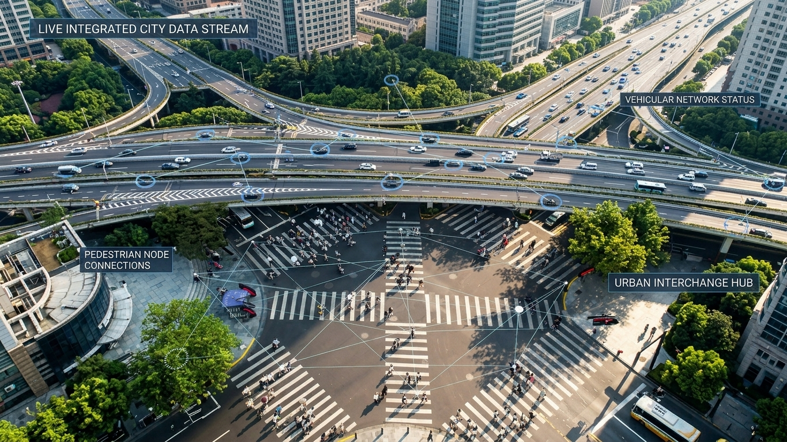

{}
{}

---

# Problem Statement

Core problem: **reconstruct latent dynamics from uncertain observations**.

Classical linear estimation techniques are not suitable: the system of interest exhibits **non-linear dynamics** and **non-Gaussian uncertainty**.

Therefore, we need an estimator that does not force the posterior into a simple closed-form shape, but can maintain **multiple uncertain hypotheses over time**.

---

# The Filtering Problem

We want to estimate the hidden state of a dynamic system over time.

{}
{}

### State-space view

At each time step:

$$
x_t = f(x_{t-1}, u_t)
$$

$$
y_t = h(x_t, v_t)
$$

where:

- $x_t$ is the hidden system state
- $y_t$ is the observation
- $u_t$ is process noise
- $v_t$ is measurement noise

{}
{}

### Filtering objective

Given all observations so far:

$$
y_{1:t} = y_1, \dots, y_t
$$

estimate the posterior belief:

$$
p(x_t \mid y_{1:t})
$$

This belief is updated recursively as new observations arrive.

{}
{}

---

# Particle Filters (PF)

A practical way to track hidden state under nonlinear and non-Gaussian uncertainty.

{}
{}

### Key idea
Instead of representing belief with a single estimate, a particle filter represents it with many possible hypotheses:

- each **particle** is one possible state of the system
- each **weight** says how plausible that hypothesis is
- likely particles are reinforced over time
- unlikely particles fade out

### Interpretation
The estimate is not only a point: it is a **cloud of weighted hypotheses**.

{}
{}

  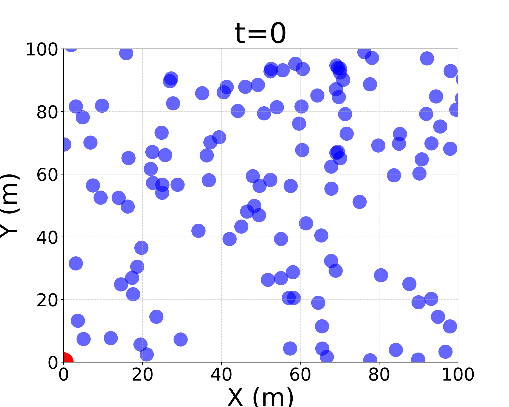

**At the beginning:** particles explore many possible states.

{}
{}

---

# (Centralized) Particle Filters

{}
{}

### Posterior approximation
We estimate a hidden state $x_t$ from noisy observations $y_{1:t}$ by representing the posterior with weighted samples:

$$
p(x_t \mid y_{1:t}) \approx \sum_i w_t^i \delta(x_t - x_t^i)
$$

### One filtering iteration
1. **Prediction:** propagate particles through the dynamical model
2. **Weighting:** compare particles with the new observation
3. **Resampling:** keep plausible hypotheses and discard weak ones
4. **Estimate:** summarize the weighted particle cloud

{}
{}

  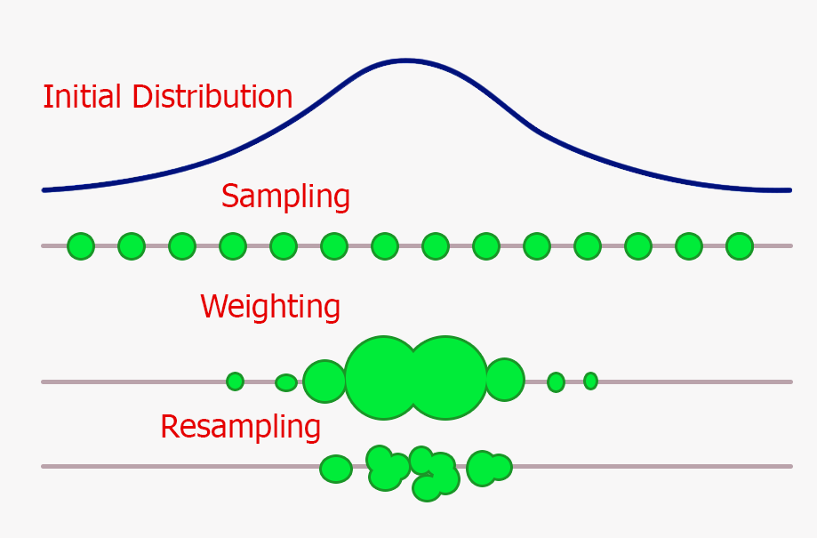

{}
{}

The hard part is maintaining this belief as observations arrive over time.

---

# Particle Filter Intuition Over Time

  

    
    
<strong>t = 0</strong> many possible hypotheses

  

  

    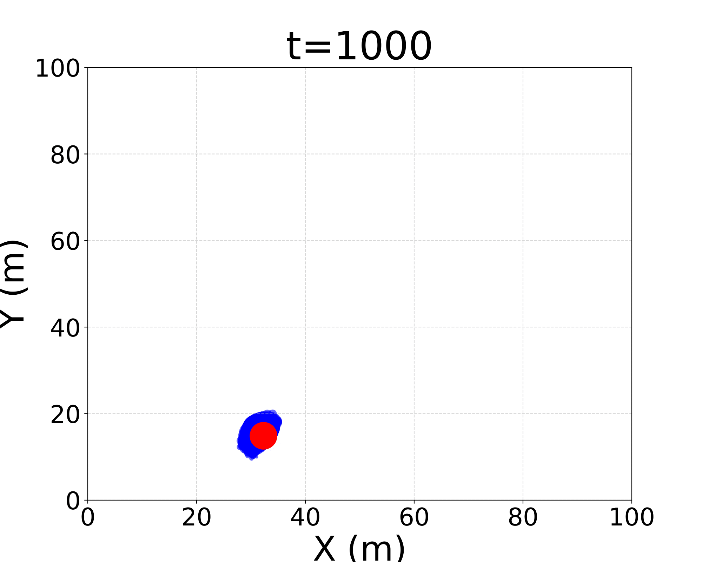
    
<strong>t = 1000</strong> belief concentrates

  

  

    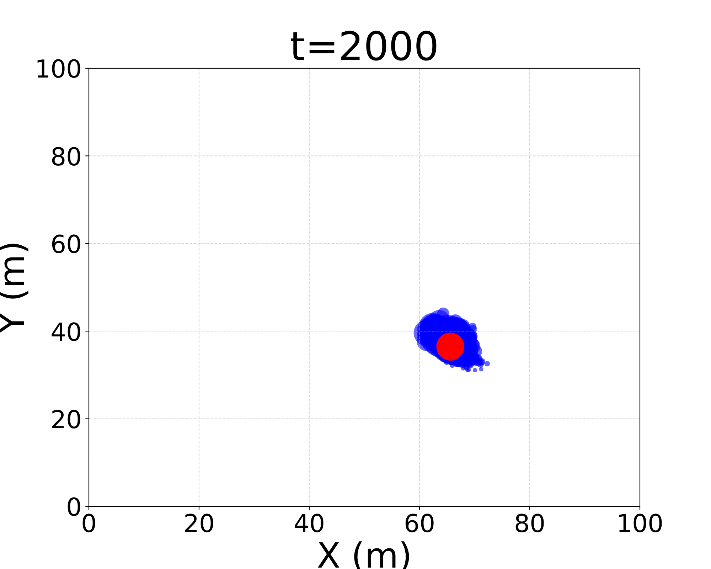
    
<strong>t = 2000</strong> the cloud follows the target

  

  

    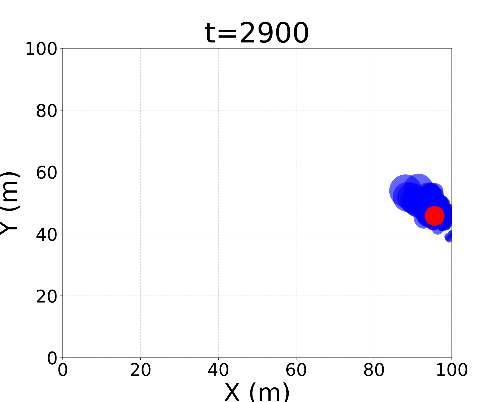
    
<strong>t = 2900</strong> uncertainty remains explicit

  

The particle cloud evolves as a moving approximation of the posterior belief.

---

# Distributed Particle Filters

In IoT systems, observations are naturally collected by many spatially distributed devices.

{}
{}

### From centralized PF
A classical PF assumes that all observations are available to a single estimator:

$$
p(x_t \mid y_{1:t})
$$

This is convenient, but hides the fact that sensing, computation, and communication are distributed.

{}
{}

### To distributed PF
Each device $k$ observes only local information:

$$
y_{t,k} = h_k(x_t, v_{t,k})
$$

The goal is to approximate a global belief from distributed observations:

$$
p(x_t \mid y_{1:t,1:K})
$$

{}
{}

DPF keeps the PF logic, but turns filtering into a **coordination problem among devices**.

---

# Different DPF Architectures

{}
{}

### Why this matters
DPF is not a single algorithmic recipe.

The literature explores different ways to decide:

- where information is fused
- which nodes participate
- what information is exchanged
- how much communication is tolerated

The paper uses these families as a **design space**, not as separate solutions to present in detail.

Main trade-off: **estimation quality vs communication burden vs robustness**.

{}
{}

  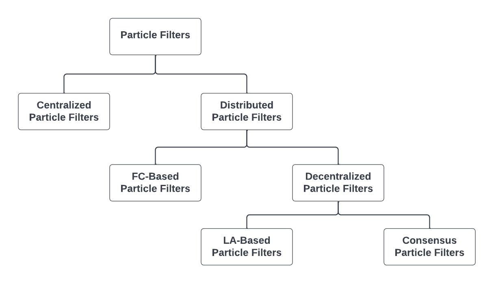

{}
{}

---

# What Makes DPF Hard in Practice?

### 01. Particles and communication are costly
Particle filters require many particles, and exchanging particles, weights, or likelihoods can dominate the method.

### 02. Networks are imperfect
Communication delays, topology changes, asynchrony, and failures affect estimation quality.

### 03. Trade-offs dominate
DPF is always a compromise among **accuracy**, **overhead**, **complexity**, and **robustness**.

---

# Aggregate Computing Background

A programming model for collective behaviour in distributed IoT systems.

{}
{}

### Usual perspective
We often design distributed algorithms by specifying:

- device roles
- message flows
- communication protocols
- failure handling strategies

{}
{}

  

### Aggregate perspective
Describe **what collective behaviour should emerge** from local interactions.

{}
{}

One macro-program runs on all devices; each device repeatedly senses, communicates with neighbours, computes, and acts.

Key point: coordination becomes a **programmable abstraction**, not an ad-hoc protocol.

---

# Computational Fields

The central abstraction of Aggregate Computing is the **computational field**.

{}
{}

### Local view
Each device computes a local value, using:

- local sensors
- local state
- messages from neighbours

### Global view
The collection of all local values forms a field:

$$
\text{device/location} \mapsto \text{value}
$$

{}
{}

  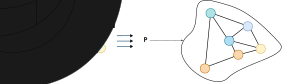

Fields can represent measurements, estimates, leaders, regions, or information flows.

{}
{}

Reusable patterns include **spreading**, **aggregation**, **converge-cast**, and **leader election**.

---

# Field-Based Distributed Particle Filtering

### Main point
The goal is **not** to introduce yet another DPF algorithm.

The idea is to expose DPF as a **configurable coordination problem**.

{}
{}

### Filtering logic
- Prediction
- Weighting
- Resampling

{}
{}

### Coordination choices
- Where fusion happens
- What is exchanged
- How far information propagates
- Who is active

{}
{}

This is the paper's main idea: architectural assumptions become **design parameters**, rather than hard-coded algorithmic commitments.

---

# Contribution 1: Aggregate Measurements

{}
{}

### A useful extra degree of freedom
Instead of exchanging particles, each node can run its own local particle filter while the weighting step exploits an **aggregated measurement function** built from neighboring observations.

$$
\hat{y}_t =
H_{\mathcal{N}(k)}
\bigl(
\{ h_j(x_t, v_{j,t}) \}_{j \in \mathcal{N}(k)}
\bigr)
$$

{}
{}

  

{}
{}

Nearby sensors collectively behave like a **distributed sensor**. This can be cheaper than exchanging particle sets.

---

# Contribution 2: Resilient Fusion Center

### Leader-based fusion as a field-level behavior
- **Election:** A leader is selected dynamically.
- **Fusion:** The leader behaves as the current fusion center.
- **Failure:** If the leader disappears, the role is released.
- **Self-healing:** A new leader resumes the behavior.

We can move along the spectrum between centralized simplicity and decentralized robustness through configuration.

---

# Experimental Evaluation

The same target-tracking intuition is used to evaluate distributed variants.

{}
{}

### Common setup
- 2D target tracking scenario
- Static network of **25 sensors** on a perturbed grid
- Signal quality degrades with distance
- Sensors execute at **1 Hz**
- **3000 simulated seconds**
- **100 random seeds** per configuration

{}
{}

### Experiment 1
**Local PF + aggregated measurements**

Each sensor runs its own particle filter; neighbouring measurements are aggregated only for the weighting step.

### Experiment 2
**Elected leader as fusion center**

Measurements are aggregated toward an elected leader; a leader failure is injected at time step **1500**.

{}
{}

Main question: **how much coordination is enough to improve tracking without paying the full cost of particle exchange?**

---

## Experiment 1: Local PF + Aggregated Measurements

Each sensor keeps its **own local particle filter**. No particles are exchanged.

Only the measurement used for weighting changes:

$$
|\mathcal{N}| \in \{0, 1, 4, 7\}
$$

Increasing the neighbourhood size improves the quality of the aggregated observation, and therefore the trajectory estimate.

---

## Experiment 1: Trajectories

  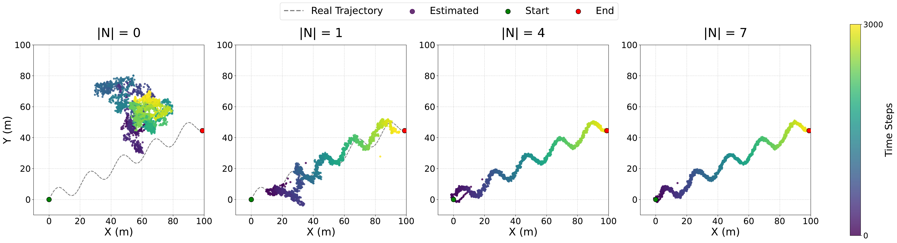

Larger neighbourhoods make the local filters converge toward the real trajectory.

---

## Experiment 1: RMSE

{}
{}

  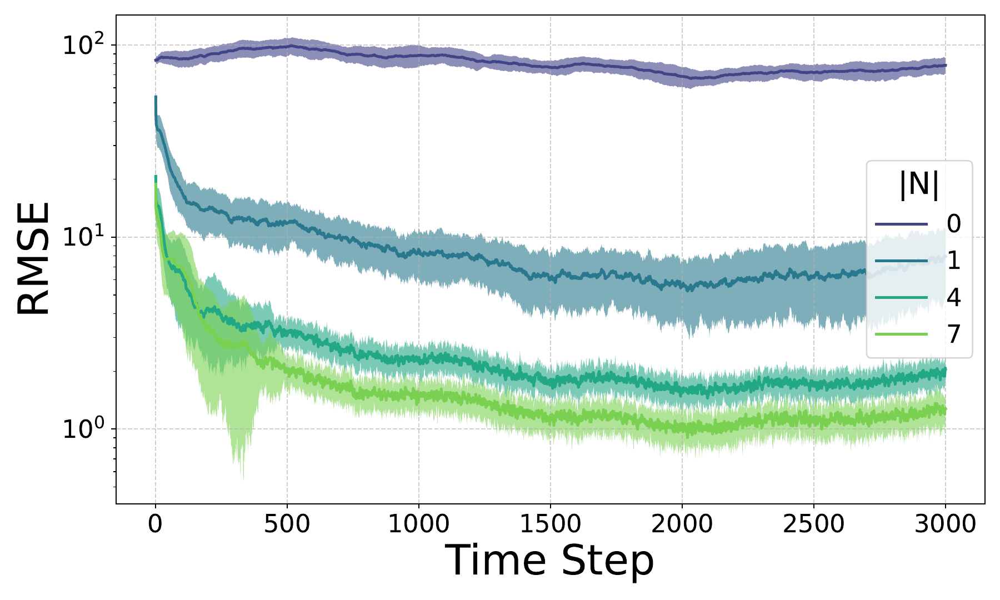

{}
{}

### Result
With few neighbours, the error remains high.

Increasing $|\mathcal{N}|$ reduces the RMSE and improves long-term stability.

The benefit comes from sharing **measurements**, not particle sets.

{}
{}

---

## Experiment 2: Leader-Based Fusion

{}
{}

An elected leader plays the fusion-center role.

When the leader fails at time step **1500**, the system briefly destabilizes and then resumes tracking after re-election.

### Message
Fusion-center behaviour can be retained without a permanently fixed center.

{}
{}

  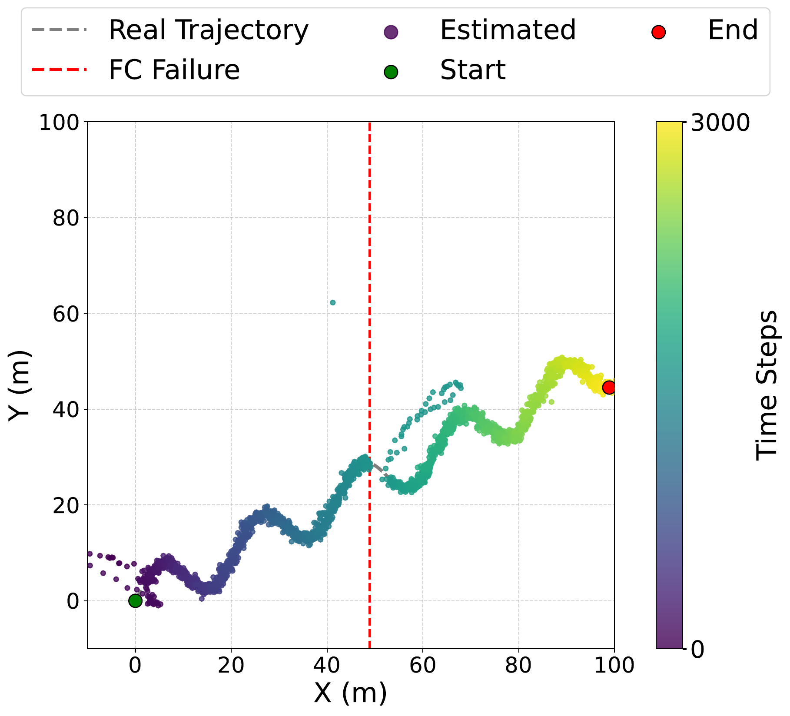

{}
{}

--- 

# Takeaways

### 01. DPF is coordination-heavy
The particle-filter machinery is standard; the difficult part is deciding how information moves through the network.

### 02. Aggregate computing exposes the design space
Fusion, propagation, exchanged information, and active regions become configurable parameters.

### 03. Local cooperation can pay off
Aggregated measurements and leader election improve estimation behavior while avoiding fully centralized assumptions.
