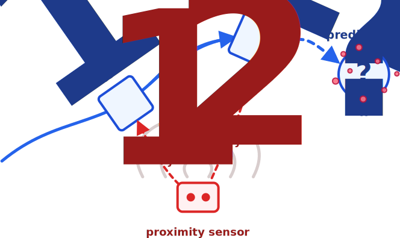
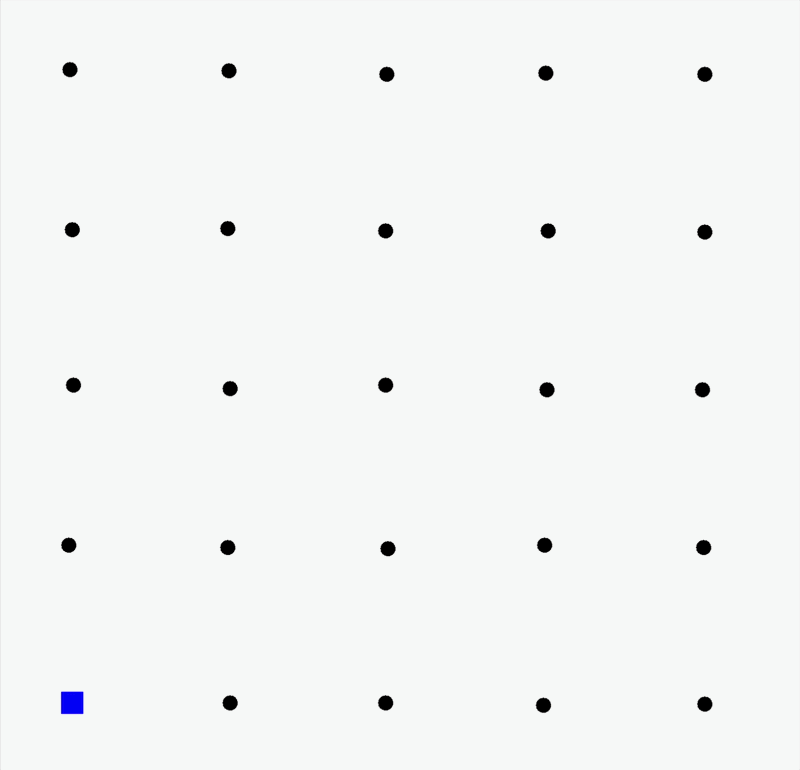

+++
title = "Flexible Distributed Particle Filtering for the Internet of Things via Aggregate Computing"
description = "DCOSS-IoT 2026 presentation"
outputs = ["Reveal"]
+++

# Flexible Distributed Particle Filtering for the Internet of Things via Aggregate Computing

{}

[**Angela Cortecchia**](mailto:angela.cortecchia@unibo.it),
[Davide Domini](mailto:davide.domini@unibo.it),
[Giovanni Ciatto](mailto:giovanni.ciatto@unibo.it),
[Roberto Casadei](mailto:roby.casadei@unibo.it),
[Danilo Pianini](mailto:danilo.pianini@unibo.it),
and
[Mirko Viroli](mailto:mirko.viroli@unibo.it)

{}

*Department of Computer Science and Engineering (DISI) 
Alma Mater Studiorum -- University of Bologna - Cesena, Italy*

  

---

# Motivation

  

    
Many cyber-physical systems must estimate a <strong>hidden dynamical state</strong> from distributed, noisy observations <small>[1]</small>.

    

      target tracking
      environmental monitoring
      mobility and traffic
      smart-city sensing
    

    

      Constraint
      
No single device directly observes the full state.

    

  

  

    
    
<strong>Tracking intuition:</strong> sensors observe fragments of evidence; the system reconstructs the target trajectory.

  


[1] O. Hlinka, F. Hlawatsch, and P. M. Djuric, "Distributed particle filtering in agent networks: A survey, classification, and comparison," IEEE Signal Process. Mag., 2013.


---

# From Observations to a Posterior Estimate

  

    
Reconstruct a latent state over time from partial and noisy observations.

    

      hidden state
      <strong>$$x_t$$</strong>
    

    

      observations
      <strong>$$y_{1:t}$$</strong>
    

    

      filtering objective
      <strong>$$p(x_t \mid y_{1:t})$$</strong>
    

  

  

    

      

      <strong>Noisy local sensing</strong>
      partial measurements
      

      
→

      

      <strong>Posterior state estimate</strong>
      uncertainty remains explicit
      

    

    
Classical linear estimators are not enough when dynamics are <strong>non-linear</strong> and uncertainty is <strong>non-Gaussian</strong>.

    
  

---

# Particle Filters

  

    
A particle filter represents belief with a <strong>cloud of weighted hypotheses</strong> <small>[2]</small>.

    

      01
      
Each particle is one possible state.

    

    

      02
      
Each weight says how plausible it is.

    

    

      03
      
Likely particles survive; unlikely particles fade out.

    

    

      predict
      weight
      resample
      estimate
    

  

  

    
    
<strong>The estimate is a distribution, not only a point.</strong>

  


In IoT, particle filtering is not only an estimation problem: it is a **coordination problem**.



[2] M. S. Arulampalam, S. Maskell, N. J. Gordon, and T. Clapp, "A tutorial on particle filters for online nonlinear/non-gaussian bayesian tracking," IEEE Trans. Signal Process., 2002.


---

# Particle Filter Over Time

  

    
    
t = 0

    
many possible hypotheses

  

  

    
    
t = 1000

    
belief concentrates

  

  

    
    
t = 2000

    
the cloud follows the target

  

  

    
    
t = 2900

    
uncertainty remains explicit

  


The particle cloud follows the target while keeping the estimation error visible as uncertainty.


---

# Distributed Particle Filters

In IoT systems, observations are naturally collected by many spatially distributed devices.

  

    <h3>Centralized PF</h3>
    
All observations are assumed to be available to one estimator.

    
$$p(x_t \mid y_{1:t})$$

    
Simple, but unrealistic for open IoT deployments.

  

  

    <h3>Distributed PF</h3>
    
Each device observes only local information.

    
$$y_{t,k} = h_k(x_t, v_{t,k})$$

    
The goal is to approximate the same global belief through local cooperation.

  


**DPF keeps the filtering logic, but turns estimation into a coordination problem.**


---

# DPF: many coordination choices

  

    
DPF algorithms differ mainly in how they move, combine, and exploit information across the network.

    

      where fusion happens
      what is exchanged
      how far evidence propagates
      which nodes participate
    

  

  

    
  

---

# What Makes DPF Hard?

{}

  

    

      <h3>Communication constraints</h3>
      
Bandwidth, latency, energy, and robustness make centralized collection unrealistic.

    

  

  

    

      <h3>Networks change</h3>
      
Delays, topology changes, asynchrony, and failures affect estimation.

    

  

  

    

      <h3>Trade-offs</h3>
      
Accuracy, overhead, complexity, and robustness must be balanced.

    

  

---

# Aggregate Computing
### A macroprogramming approach to coordination

  

    
  

  

      
Aggregate Computing lets developers describe the <strong>collective behavior</strong> of a system, rather than programming each device separately <small>[3]</small>.

    
The program manipulates <strong>computational fields</strong>: distributed values evolving across the network <small>[4]</small>.

  

  spreading information
  aggregating evidence
  converging data
  electing leaders


**Key intuition:** devices execute local code, but the programmer reasons in terms of global coordination patterns.



[3] J. Beal, D. Pianini, and M. Viroli, "Aggregate programming for the internet of things," Computer, 2015. 
[4] G. Audrito, M. Viroli, F. Damiani, D. Pianini, and J. Beal, "A higher-order calculus of computational fields," ACM Trans. Comput. Log., 2019.


---

# AC Computational Model

{}
{}

### From collective program to local execution

  

    
One program, many local executions

    

      01
      
<strong>Collective specification.</strong> The programmer writes the behavior of the whole device network.

    

    

      02
      
<strong>Local rounds.</strong> Each device evaluates the same program using local sensors, memory, and neighbor messages.

    

    

      03
      
<strong>Emergent field.</strong> The collection of local values forms the global computational field.

    

  

  local sensing
  neighbor exchange
  state update
  field evolution

{}
{}

### Round-based model

  

    
<strong>Each round consists of three repeated phases:</strong>

    <ol>
      <li class="fragment" data-fragment-index="1">
        <strong class="local-round-sense-text">Sense</strong> collect sensor inputs and incoming neighbor messages.
      </li>
      <li class="fragment" data-fragment-index="2">
        <strong class="local-round-compute-text">Compute</strong> run local state evaluation logic to produce new state and outbound messages.
      </li>
      <li class="fragment" data-fragment-index="3">
        <strong class="local-round-interact-text">Interact / Act</strong> share results and affect the local environment.
      </li>
    </ol>
    
The model does not require global lock-step.

  



{}
{}

---

# Key Idea: DPF as a Field Computation

The goal is <strong>not</strong> to introduce yet another DPF algorithm.

  

    <h3>Filtering logic</h3>
    
This remains standard.

    

      prediction
      weighting
      resampling
      estimation
    

  

  

    <h3>Coordination choices</h3>
    
These become programmable.

    

      where fusion happens
      what to exchange
      how information propagates
      who is active
    

  


**Architectural assumptions become design parameters.**


---

### Contribution 1: 
# Aggregate measurement function

  

    
Each node keeps its own local particle filter.

    
Instead of exchanging particle sets, neighbors share raw observations; local likelihoods are combined during the weighting step.

    
Nearby sensors collectively behave like a <strong>distributed sensor</strong>.

  

  

    \[
    \hat{y}_t =
    H_{\mathcal{N}(k)}
    \bigl(
    \{ h_j(x_t, v_{j,t}) \}_{j \in \mathcal{N}(k)}
    \bigr)
    \]
  


<strong>Intuition:</strong> more neighbors provide richer local observations, so the aggregated measurement becomes more informative; with few neighbors, the estimate remains weaker and less stable.


---

### Contribution 2: 
# Self-Healing Fusion Center

  

    <h2>Leader-based fusion as a field-level behavior <small>[5] [6]</small></h2>
    

      01
      
<strong>Election.</strong> A leader is selected dynamically.

    

    

      02
      
<strong>Fusion.</strong> The leader behaves as the current fusion center.

    

    

      03
      
<strong>Failure.</strong> If the leader disappears, the role is reassigned.

    

    

      04
      
<strong>Self-healing.</strong> A new leader resumes the behavior.

    

  

  

    
Configuration lets us move along the spectrum between centralized simplicity and decentralized robustness.

  


[5] M. Viroli, G. Audrito, J. Beal, F. Damiani, and D. Pianini, "Engineering resilient collective adaptive systems by self-stabilisation," ACM Trans. Model. Comput. Simul., 2018. 
[6] D. Pianini, R. Casadei, and M. Viroli, "Self-stabilising priority-based multi-leader election and network partitioning," ACSOS, 2022.


---

# Experimental Evaluation

  

    <h3>Scenario</h3>
    

      2D target tracking
      25 sensors
      1 Hz, unsynchronized
      3000 simulated seconds
      100 seeds
    

    
Each sensor observes the target through a radio-like signal: closer targets produce stronger, cleaner evidence; farther targets produce weaker and noisier evidence <small>[7] [8]</small>.

    
Simulations are implemented in Alchemist<small>[7]</small>, with aggregate program written using Collektive <small>[8]</small>.

  

  

    <h3>Evaluated configurations</h3>
    

      1
      
<strong>Local PF + aggregated measurements</strong> each sensor has its own PF; only measurements are shared.

    

    

      2
      
<strong>Elected leader as fusion center</strong> measurements converge to a leader; failure is injected at time step 1500.

    

  


[7] D. Pianini, S. Montagna, and M. Viroli, "Chemical-oriented simulation of computational systems with alchemist," Journal of Simulation, 2013.
[8] A. Cortecchia, "Multiplatform self-organizing systems through a KotlinMP implementation of aggregate computing," ACSOS Companion, 2024. 


---

## Experiment 1: AGGREGATE MEASUREMENT FUNCTION

  

    
Each sensor keeps its <strong>own local particle filter</strong>. No particles are exchanged.

  

  
$$|\mathcal{N}| \in \{0, 1, 4, 7\}$$

  

    
<strong>Small neighborhood</strong> → weak evidence → high error

    
<strong>Larger neighborhood</strong> → aggregated evidence → better tracking

  

  

---

## Experiment 1 results: RMSE

{}
{}

  

{}
{}

- RMSE measures the distance between the estimated target position and the real one.
- With few neighbors, the error remains high.
- Increasing $|\mathcal{N}|$ reduces RMSE and improves long-term stability.
- The benefit comes from sharing **measurements**, not particle sets.

{}
{}

---

## Experiment 2: Self-Healing Fusion

  

    
An elected leader plays the fusion-center role. At time step <strong>1500</strong>, the leader fails.

    

      01
      
Transient during initial leader election

    

    

      02
      
Convergence to a valid estimation

    

    

      03
      
Transient after leader failure

    

    

      04
      
Resumed tracking after re-election

    

    
Fusion-center behavior can be retained without a permanently fixed center.

  

  

    
    
The red line marks the failure; the following deviation is the temporary tracking error caused by reconfiguration.

  

--- 

# Takeaways and Future Work

  

    <h2>Takeaways</h2>
    

      -
      
<strong>DPF as field computation.</strong> Filtering stays standard; coordination becomes programmable.

    

    

      -
      
<strong>Flexible architectures.</strong> Fusion, dissemination, and active regions become configurable choices.

    

    

      -
      
<strong>Local likelihood aggregation works.</strong> Sharing observations improves tracking without exchanging particle sets.

    

    

      -
      
<strong>Fusion can self-heal.</strong> Leader election preserves fusion-center behavior after failures.

    

  

  

    <h2>Future work</h2>
    

      <h3>Explore more AC design dimensions</h3>
      
Broader coordination strategies for propagation and fusion; activation only in relevant regions.

    

    

      <h3>Extend the scenarios</h3>
      
Multiple moving targets, flocking-inspired coordination, heterogeneous sensing, and richer deployment conditions.

    

  

--- 

# Thank you for your attention!

{}

### Reproducible experiments here:

  
  
<i class="fab fa-github mr-3" style="color: #095aa6;"></i> <a href="https://github.com/domm99/experiments-ac-based-distributed-particle-filtering">domm99/experiments-ac-based-distributed-particle-filtering</a>

